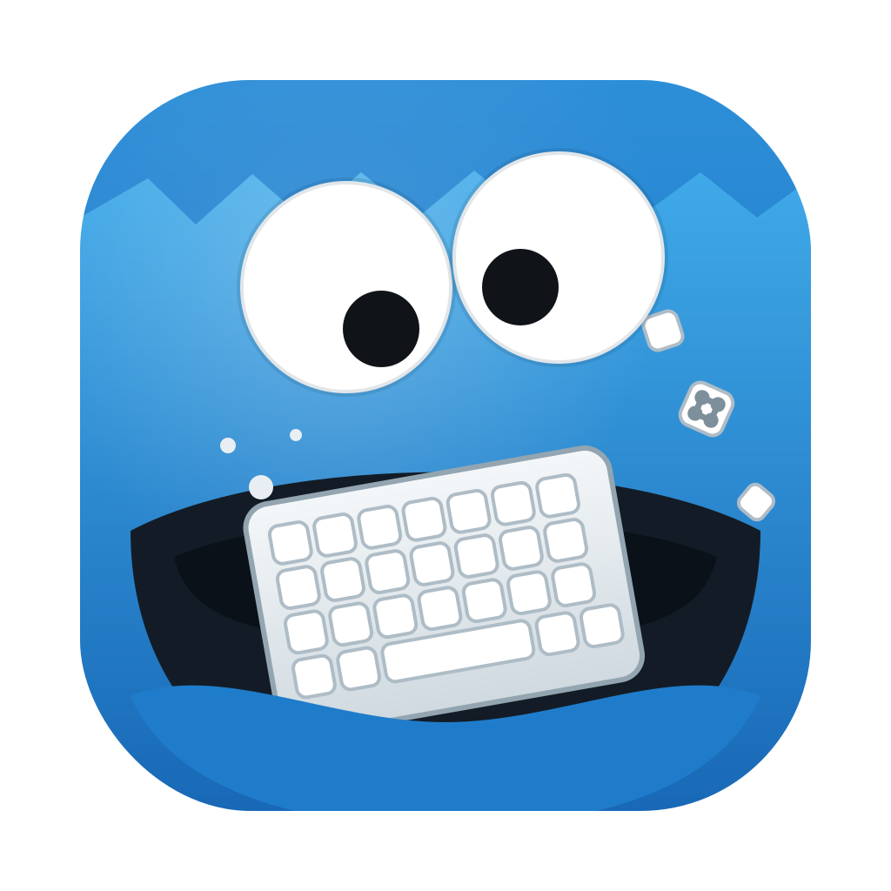

<p align="center">
  
</p>

# Key Monster

A keyboard-driven macOS utility built around your clipboard. Key Monster lives in
the menu bar, quietly records what you copy, and lets you search back through it
and paste any earlier entry from a fast, centered panel — plus a set of
keyboard-only ways to drive the rest of your Mac: focus apps, click anything on
screen, and jump the caret through text, all without the mouse.

## Features

### Clipboard history

- **Menu bar resident** — runs as a background accessory (`LSUIElement`), no Dock
  icon, no window cluttering your screen.
- **Captures text, images, and files** — records plain text, images (e.g. copied
  from Preview or a browser), and file URLs (files copied in Finder).
- **Search-first, two-pane panel** — a floating, centered panel with a search
  field that matches across text content, file names, and the source app name.
  The left column lists matches; the right column previews the full content of the
  selected item — the complete text, the image, or every file path.
- **Fully keyboard-driven** — open with a global shortcut, type to filter, and
  navigate without touching the mouse:
  - `↑` / `↓` or `Ctrl-N` / `Ctrl-P` — move the selection
  - `Ctrl-J` / `Ctrl-K` — scroll the preview pane for long content
  - `Return` — paste the highlighted item into the app you were just using
    (or copy it, if auto-paste is off or unavailable)
  - `Esc` — dismiss the panel (it also closes when it loses focus)
- **Auto-paste** — `Return` pastes the selection straight into the previously
  focused app by synthesizing a `⌘V`, so you don't have to switch back and paste
  manually. On by default; it needs Accessibility permission (Key Monster requests
  it when you enable the toggle) and gracefully falls back to copy-only without it.
- **Source app tracking** — each entry remembers (and shows the icon of) the app
  it was copied from. The origin is preserved when you re-select an old item.
- **Password-manager aware** — respects the
  [nspasteboard.org](http://nspasteboard.org) convention and skips clipboard
  contents marked concealed, transient, or auto-generated.
- **Persistent & deduplicated** — history is stored locally in SQLite and
  survives restarts. Duplicate copies move to the top instead of piling up; the
  store is capped at 10,000 items.

### Keyboard shortcuts for the rest of your Mac

- **Configurable global shortcut** — record any modifier + key combo in Settings
  to summon the history panel from anywhere.
- **App focus shortcuts** — bind a global shortcut to one or more apps. Press it
  to focus the app; press again while one is frontmost to cycle through the rest,
  so a single combo can rotate through e.g. Slack and Chrome. Settings warns when
  a combo is bound more than once, since only the first binding can register.
- **Click hints (vimium-style)** — press a shortcut and every clickable element
  in the frontmost window grows a short label (a single home-row letter when
  few elements are visible, two letters otherwise); type a label to click it
  without touching the mouse. Works on native macOS
  controls and on web content in Safari, Chrome, and Electron apps (Key Monster
  asks them to expose their accessibility trees). Separate shortcuts for
  left-click and right-click hints; holding `Shift` on the final letter clicks
  with the opposite button. Elements too close together to label individually
  share one green area label — typing it zooms into that area (a magnified
  screenshot with Screen Recording permission, sketched outlines without) and
  each element gets a normal label; `Delete` backs out of the zoom. `Esc`, a
  real click, or any other chord dismisses the overlay. Requires Accessibility
  permission.
- **Grid click** — for clicking somewhere with no element to label, a shortcut
  overlays a fine grid on the frontmost window, each cell wearing a short
  home-row label; type the label nearest your target to pick a starting cell.
  From there the grid mirrors the keyboard's three letter rows (`Q`…`\`,
  `A`…`'`, `Z`…`/`), so the key under your finger names the cell in the same spot
  on screen — and each keypress zooms into that cell, magnifying it into a loupe
  so small targets stay legible. After a few zooms the next key clicks its cell.
  `Return` clicks the center of the current region at any point, and holding
  `Shift` on the deciding key right-clicks instead. `Delete` zooms back out (and
  from the first zoom, back to the initial label grid); `Esc`, a real click, or
  any other chord dismisses. Requires Accessibility permission.
- **Text jump (jump to character)** — press a shortcut while a text field is
  focused, then any character; every visible occurrence of it in the field grows
  a short label (one letter when there are only a few, two otherwise), and typing
  a label drops the caret just before that character. Matching is case-insensitive and works on digits, punctuation, and
  spaces too. Occurrences too close together share one green area label that
  zooms in, just like click hints. Works in native macOS fields and in web text
  areas (Safari, Chrome, Electron). `Delete` backs out of the zoom, then back to
  pick a different character; `Esc`, a real click, or any other chord dismisses.
  Requires Accessibility permission.
- **Menu search** — press a shortcut to list the frontmost app's entire menu bar
  in a searchable panel. Type to fuzzy-find across the whole menu path (so `exp
pdf` reaches **File › Export › PDF…**); the closest match floats to the top.
  Navigate with `↑` / `↓` or `Ctrl-N` / `Ctrl-P`, and press `Return` to run the
  highlighted item back in that app — no reaching for the mouse to hunt through
  menus. `Esc` cancels. Disabled items and separators are skipped. Requires
  Accessibility permission.
- **Script shortcuts** — point a global shortcut at any script file on disk and
  press it to run the script in the background — toggle dark mode, start a
  timer, rearrange windows, whatever you can script. Pick the file with a
  chooser or drag it from Finder onto the Scripts tab — onto a row to change
  that row's script, or onto **Add Script** to create shortcuts for the
  dropped files. How it runs is inferred
  from the file: AppleScript (`.scpt`, `.scptd`, `.applescript`) runs via
  `osascript`, executable files run directly (their shebang picks the
  interpreter), and anything else runs in `zsh` as a login shell, so your usual
  `PATH` applies. Failures (non-zero exits, with stderr) are appended to
  `~/Library/Logs/keymonster/scripts.log`; the Scripts settings tab shows the
  latest failure with an **Open Log** button, and everything is also logged
  under the `keymonster` subsystem in Console.

### Convenience

- **Launch at login** — an optional toggle registers Key Monster to start
  automatically when you log in.
- **Update aware** — the app checks GitHub daily and adds an "Update Available"
  item to its menu when a newer release exists. Nothing downloads or installs
  behind your back; the item just opens the release page. Opt out any time with
  the "Check for Updates" toggle in Settings.

## Download

Grab the latest `KeyMonster-<version>.dmg` from the
[Releases](../../releases/latest) page, open it, and drag **Key Monster.app**
into `/Applications`. Releases are signed with a Developer ID certificate and
notarized by Apple, so it opens like any other app.

Prefer to build it yourself? See [Building & Running](#building--running) below.

## Requirements

- macOS 14 (Sonoma) or later
- Swift 6 toolchain (Xcode 16+) to build
- [SwiftLint](https://github.com/realm/SwiftLint) for `make lint`

## Building & Running

The project uses a `Makefile` for common tasks:

```sh
make run      # build a proper .app bundle (icon, menu bar agent, signed) and open it
make app      # build the .app bundle without launching it
make build    # plain `swift build`
make install  # build a release bundle and copy it into /Applications
make test     # run the test suite
make lint     # run SwiftLint
make icon     # regenerate Resources/AppIcon.icns from Resources/icon.svg
make dist     # build the release .app and package it into a DMG in .build/dist/
make notarize # submit the DMG to Apple's notary service and staple the ticket
make clean    # clean build artifacts
```

`make run` assembles a real `.app` bundle so the menu bar agent, icon, and code
signature are in place. Because persistence is SQLite (via
[GRDB](https://github.com/groue/GRDB.swift)) rather than something requiring a
bundle identifier, plain `swift run` also works for day-to-day development.
`make install` builds a release bundle and installs it to `/Applications`
(override with `make install INSTALL_DIR=~/Applications`).

Accessibility grants (needed for auto-paste, click hints, grid click, and text
jump) are tied to the app's code-signing identity. The `Makefile` auto-detects a
real signing identity from your keychain and signs with it, so the grant persists
across rebuilds; it falls back to ad-hoc signing if none is found (in which case
macOS forgets the grant on every rebuild). Override explicitly with
`make run CODESIGN_IDENTITY=<identity>` if needed.

### Cutting a release

See [RELEASING.md](RELEASING.md) for the release workflow — tagging, signing,
notarization, and the GitHub Actions pipeline.

## Usage

1. Launch Key Monster — the monster-keyboard glyph appears in the menu bar.
   On first launch the Settings window opens automatically.
2. Settings is organized into tabs, one per feature, each with a short
   description of what it does. In the **Clipboard** tab, record a **Clipboard
   Shortcut**. To use auto-paste, leave **Paste into the active app on Return**
   enabled and grant **Accessibility** access when prompted (Key Monster links
   you to the right System Settings pane).
3. Optionally set up the other tabs — **Focus** (app switching), **Clicking**
   (hints and grid), **Text** (jump to character), **Menus** (menu search), and
   **Scripts** (run script files) — and toggle **Launch at Login** in the
   **General** tab, which leads the row.
4. Copy things as you normally would; Key Monster records them in the background.
5. Press your shortcut (or choose **Show Clipboard History** from the menu) to open the
   panel, type to search, select an entry, and press `Return` — it pastes into
   the app you came from (or just copies, if auto-paste is off/ungranted).

Your history is stored at:

```
~/Library/Application Support/keymonster/history.sqlite
```

## Architecture

See [ARCHITECTURE.md](ARCHITECTURE.md) for a file-by-file map of the codebase.

## Tech Stack

- Swift 6 + SwiftUI + AppKit
- [GRDB](https://github.com/groue/GRDB.swift) for SQLite persistence
